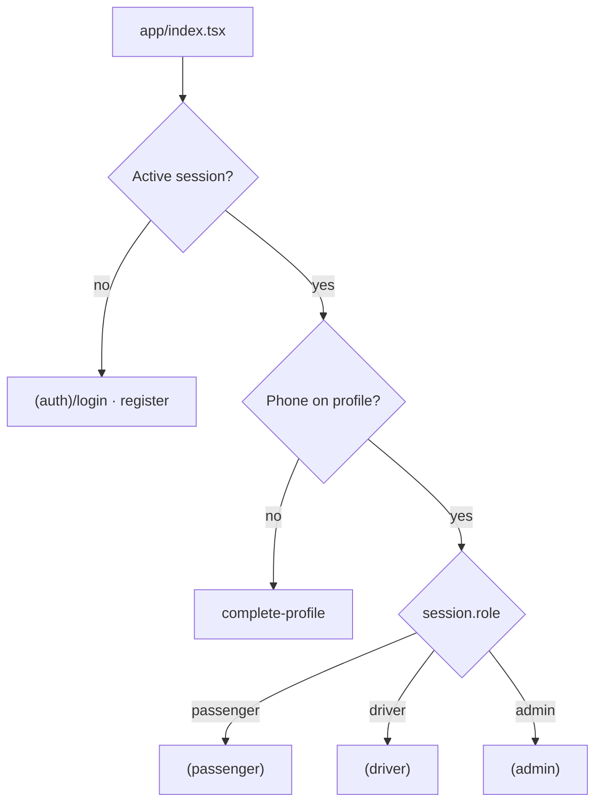
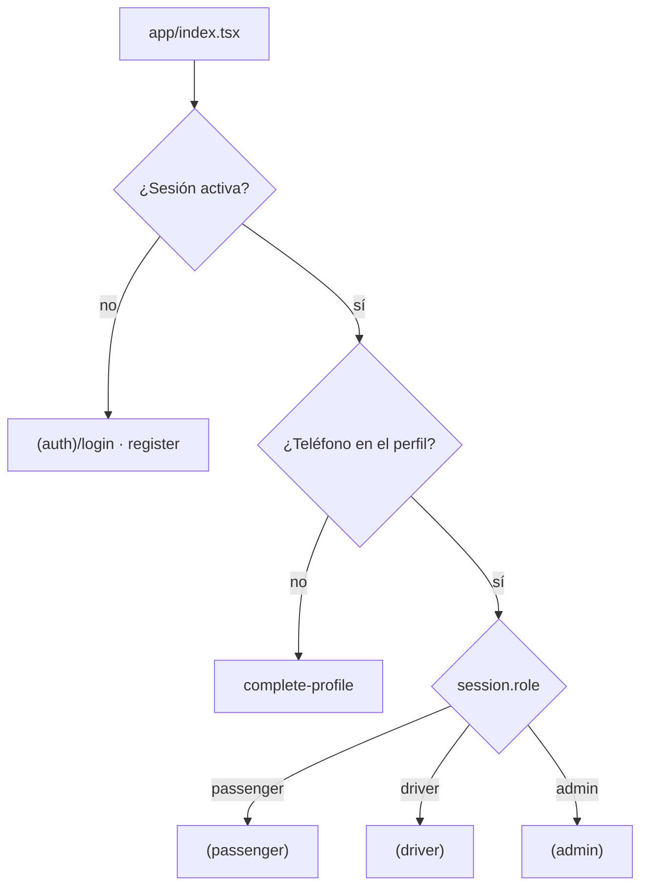

<div align="center">


# CatrachoGo Mobile

**Native ride-hailing app for Honduras — passenger, driver and admin in one build.**
_App móvil nativa de ride-hailing para Honduras — pasajero, conductor y administrador en una sola app._


**[English](#english) · [Español](#español)**

</div>

---

# English

## Table of contents

- [Overview](#overview)
- [Feature set by role](#feature-set-by-role)
- [Tech stack](#tech-stack)
- [Getting started](#getting-started)
- [Environment variables](#environment-variables)
- [Running the app](#running-the-app)
- [What does not work in Expo Go](#what-does-not-work-in-expo-go)
- [Project structure](#project-structure)
- [Architecture](#architecture)
- [Backend integration](#backend-integration)
- [Business rules](#business-rules)
- [Real-time strategy](#real-time-strategy)
- [Design system](#design-system)
- [Native integrations](#native-integrations)
- [Quality checks](#quality-checks)
- [Test builds (EAS)](#test-builds-eas)
- [Conventions & workflow](#conventions--workflow)
- [Troubleshooting](#troubleshooting)

## Overview

`catrachogo-mobile` is the native mobile client of **CatrachoGo**, a ride-hailing platform built for Honduras. It is **not a redesign** of the product: it implements the same functionality already shipped and validated in the web client (`catrachogo-web`), talking to the same NestJS backend (`catrachogo-api`), adapted to a native experience — gestures, camera/location permissions, drawer navigation and push notifications.

The platform is made of three repositories:

| Repository              | Role                                                       |
| ----------------------- | ---------------------------------------------------------- |
| `catrachogo-api`        | NestJS backend — single source of truth for data and rules |
| `catrachogo-web`        | Web client (admin panel + passenger/driver flows)          |
| **`catrachogo-mobile`** | **This repo — native app for the three roles**             |

The app covers **all three roles** — passenger, driver and admin — each with its own route group and its own drawer. The admin panel keeps existing on the web too; mobile adds a second surface rather than replacing it.

## Feature set by role

### 🧍 Passenger

- Request a trip on a map with Google Places address autocomplete and fare estimate before confirming.
- Live trip screen with driver tracking, ETA, route polyline and pulsing location markers.
- Cancel with a reason, rate the driver at the end.
- Trip history and activity feed with a detail modal per trip.
- Wallet: balance, transaction history and top-up via PayPal.
- Saved/favorite addresses and recent destinations.
- Incident reports.

### 🚗 Driver

- Profile completion with document upload (license, ID, vehicle photos) to Cloudinary.
- Availability toggle — gated by admin approval (`403` until documents are verified).
- Incoming trip requests with accept/reject and race-condition handling.
- Active trip with pickup/dropoff phases, navigation, no-show reporting and early trip end.
- Trip history and earnings.
- Wallet with withdrawal requests.

### 🛡️ Admin

- Dashboard with KPIs and a completed-trips chart.
- Driver verification queue with per-driver detail and document review.
- Trip listing and inspection.
- Fare zones management.
- Withdrawal approvals.
- Incident report queue.

### Shared across all roles

Drawer navigation · light/dark theme (follows the OS, with a manual override in Profile) · in-app notification center · help screen with FAQ and legal documents · offline banner · global error boundary · toast feedback.

## Tech stack

| Layer         | Choice                                                                                   |
| ------------- | ---------------------------------------------------------------------------------------- |
| Framework     | React Native `0.81.5` + Expo SDK `54` (managed workflow), React `19.1`, TypeScript `5.9` |
| Navigation    | `expo-router` `~6.0` (file-based, `typedRoutes` enabled) + `@react-navigation/drawer`    |
| Maps          | `react-native-maps` `1.20.1` (+ `@googlemaps/polyline-codec` for route decoding)         |
| HTTP          | `axios` with a bearer-token + platform-header interceptor                                |
| Storage       | `expo-secure-store` (session token and theme preference)                                 |
| Location      | `expo-location` (foreground only)                                                        |
| Notifications | `expo-notifications` + Expo push tokens (Android)                                        |
| Media         | `expo-image-picker` → Cloudinary unsigned upload                                         |
| Auth          | Email/password + Google via `@react-native-google-signin/google-signin`                  |
| Payments      | PayPal through `expo-web-browser` auth session + deep link return                        |
| UI            | `@gorhom/bottom-sheet`, `react-native-reanimated`, `@expo/vector-icons`                  |
| Tooling       | ESLint (`eslint-config-expo`), Prettier, `tsc --noEmit`                                  |

> **SDK 54 is pinned on purpose.** Do not bump it without verifying `react-native-maps` and the native modules first.

## Getting started

### Prerequisites

- **Node.js 20+** (LTS recommended) and npm.
- The [Expo Go](https://expo.dev/go) app, **or** a dev client / emulator (Android Studio / Xcode).
- **`catrachogo-api` running locally** — the app does nothing without the backend.

### Install

```bash
git clone <repo-url>
cd catrachogo-mobile
npm install
cp .env.example .env
```

Then fill in `.env` (see the table below) and run `npm start`.

## Environment variables

Expo only exposes variables prefixed with `EXPO_PUBLIC_*` to the bundle. The **only required** one is `EXPO_PUBLIC_API_URL` — without it, `constants/Config.ts` throws at startup. Everything else degrades gracefully: features depending on a missing key simply don't render or fail with a localized message, never crashing the app.

| Variable                                               | Purpose                                                                                                                                                        | If missing                                 |
| ------------------------------------------------------ | -------------------------------------------------------------------------------------------------------------------------------------------------------------- | ------------------------------------------ |
| `EXPO_PUBLIC_API_URL`                                  | `catrachogo-api` base URL. **Required.**                                                                                                                       | App does not start.                        |
| `EXPO_PUBLIC_GOOGLE_MAPS_API_KEY_ANDROID` / `_IOS`     | Native map SDK key (`react-native-maps`). Restrict by package name (Android) / bundle ID (iOS). Only read in `app.config.ts`.                                  | Map renders grey.                          |
| `EXPO_PUBLIC_GOOGLE_PLACES_API_KEY`                    | Places API (New) + Directions API, called over REST from `lib/places/` and `lib/directions/`. Must have **no application restriction** (API restriction only). | No address autocomplete, no route drawing. |
| `EXPO_PUBLIC_GOOGLE_WEB_CLIENT_ID`                     | Google OAuth **Web** client ID used to obtain the `idToken`.                                                                                                   | "Continue with Google" button is hidden.   |
| `EXPO_PUBLIC_CLOUDINARY_CLOUD_NAME` / `_UPLOAD_PRESET` | Profile photo and driver document uploads (same _unsigned_ preset as `catrachogo-web`).                                                                        | Image uploads fail.                        |
| `EXPO_PUBLIC_PAYPAL_CLIENT_ID`                         | **Unused today** — the checkout order is created server-side. Kept for compatibility.                                                                          | Nothing.                                   |
| `EXPO_PUBLIC_SUPPORT_EMAIL`                            | Contact address shown on the Help screen.                                                                                                                      | Contact block is omitted.                  |
| `EXPO_PUBLIC_ENABLE_DEMO_MODE`                         | `true` enables the "Simular llegada (demo)" button on the driver trip screen for demoing the flow without physically moving. Keep it off in normal use.        | No demo mode (default).                    |

### Picking the right `EXPO_PUBLIC_API_URL`

| Target                                 | Value                                                  |
| -------------------------------------- | ------------------------------------------------------ |
| Web / iOS Simulator                    | `http://localhost:3000`                                |
| Android emulator                       | `http://10.0.2.2:3000`                                 |
| Physical device (Expo Go / dev client) | Your machine's LAN IP, e.g. `http://192.168.1.50:3000` |

> The backend has **no `/api` prefix** — routes hang off the root (`POST /auth/login`).
> Expo reads env vars only when the dev server boots, not on Fast Refresh — **restart `npm start` after editing `.env`.**

## Running the app

```bash
npm start        # Expo dev menu (scan the QR with Expo Go, or press a / i / w)
npm run android  # open directly on an Android emulator/device
npm run ios      # open directly on an iOS simulator (macOS only)
npm run web      # open in the browser
```

## What does not work in Expo Go

Two features depend on native modules that Expo Go does not bundle. The app **does not crash** — they simply behave as if absent:

- **Google Sign-In** — the button is not rendered (lazy `require` + `StoreClient` detection). Email/password login still works.
- **Push notifications** — no token is registered and no remote notification arrives. Push is also **Android-only** today and requires a physical device. The in-app notification center still works, because it goes through the API.

To exercise both, build a dev client (`--profile development`, see [Test builds](#test-builds-eas)).

## Project structure

```
app/                       Expo Router routes
├── _layout.tsx            Providers + Stack.Protected guards by session/role
├── index.tsx              Single entry decision point (session → phone → role)
├── (auth)/                login, register
├── (passenger)/           (tabs)/ drawer + request-trip, trip/[tripId]
├── (driver)/              (tabs)/ drawer + complete-profile, request/[tripId], trip/[tripId]
├── (admin)/               (tabs)/ drawer + driver/[driverId]
├── complete-profile.tsx   Phone capture gate (business rule #1)
├── notifications.tsx      In-app notification center
├── support.tsx            FAQ + contact
├── legal/[doc].tsx        Terms / privacy
└── paypal-return.tsx      Deep-link landing for the PayPal flow

components/                Shared components
├── ui/                    Base kit: Button, Card, TextField, ModalCard,
│                          ConfirmDialog, ScreenHeader, SegmentedTabs, ImageSourceActionSheet
├── TripMap.tsx(.web.tsx)  Map wrapper with a web fallback
├── ProfileScreen.tsx      Shared profile screen for the three roles
└── …                      Modals: cancel, rating, top-up, withdrawal, incident report, …

constants/                 Colors, typography, config, and label/icon maps per status or type
lib/
├── api/                   One file per domain over api/client.ts (axios) + errors.ts (ES messages)
├── auth/                  AuthContext + secure-store session
├── theme/                 ThemeContext, persisted light/dark preference
├── notifications/         Expo push token registration + deep-link routing
├── cloudinary/            Unsigned uploads
├── places/ directions/    Google REST clients
├── location/ geo/         Permissions, reverse geocoding, distance helpers
├── hooks/                 usePolling, useDebouncedValue, useSmoothedPosition
├── network/ toast/        Connectivity detection, transient feedback
assets/                    Fonts and logo
```

Expo configuration lives in **[`app.config.ts`](./app.config.ts)** (TypeScript, dynamic) rather than `app.json`, so Google API keys can be read from the environment. Build profiles are in [`eas.json`](./eas.json).

> **Naming caveat:** the `(tabs)` folders are **no longer tabs** — they are drawers (`expo-router/drawer` + `components/AppDrawerContent.tsx`). The name survived from the original scaffold.

## Architecture

### Provider order (`app/_layout.tsx`)

```
GestureHandlerRootView → AppThemeProvider → ToastProvider → AuthProvider → Stack
```

### Navigation flow



Route groups are mounted with `Stack.Protected` guards, so a group simply does not exist when its guard is false. **`app/index.tsx` is the only place that decides where to land** — do not scatter that logic across screens.

### Drawer entries

| Passenger | Driver    | Admin                   |
| --------- | --------- | ----------------------- |
| Inicio    | Inicio    | Dashboard               |
| Actividad | Historial | Conductores             |
| Wallet    | Wallet    | Viajes                  |
| Perfil    | Perfil    | Retiros                 |
|           |           | Zonas y tarifas         |
|           |           | Reportes de incidencias |
|           |           | Perfil                  |

Every drawer also carries **Ayuda y soporte** and **Cerrar sesión**.

## Backend integration

All requests go through `lib/api/client.ts`, an axios instance that injects on **every** call:

```
Authorization: Bearer <jwt>      when a session exists
X-Client-Platform: mobile        always
```

`X-Client-Platform: mobile` makes the backend sign the JWT with `JWT_EXPIRES_IN_MOBILE` (30 days by default) instead of the 7-day web expiry — an installed app should not ask for credentials as often as a browser tab. There are **no refresh tokens**: when the JWT expires, the user logs in again.

### API domains (`lib/api/`)

| File                 | Covers                                                          |
| -------------------- | --------------------------------------------------------------- |
| `client.ts`          | axios instance, interceptors, `getApiStatusCode`                |
| `errors.ts`          | HTTP status → Spanish message (`translateLoginError`, …)        |
| `trips.ts`           | estimate, create, detail, cancel, accept, status transitions    |
| `drivers.ts`         | profile completion, availability, pending requests, summary     |
| `wallet.ts`          | balance, transactions, PayPal top-up, withdrawals               |
| `admin.ts`           | stats, driver verification, trips, withdrawals                  |
| `fareZones.ts`       | fare zone CRUD                                                  |
| `incidentReports.ts` | incident creation and queue                                     |
| `ratings.ts`         | post-trip ratings                                               |
| `savedAddresses.ts`  | favorite addresses                                              |
| `tracking.ts`        | driver location push/pull                                       |
| `notifications.ts`   | notification list, unread count, push-token register/unregister |

### Error handling

`lib/api/errors.ts` centralizes translation so no screen invents its own copy:

| Status        | Meaning in this app                                                   |
| ------------- | --------------------------------------------------------------------- |
| `400` / `401` | Invalid credentials or payload                                        |
| `402`         | Insufficient wallet balance                                           |
| `403`         | Driver not approved by an admin yet                                   |
| `409`         | Trip already taken (accept race)                                      |
| `429`         | Rate limited — shown as "too many attempts", never as a generic error |

## Business rules

The app must respect the same seven rules validated on the web client:

1. **Phone is mandatory** to request a trip — missing phone routes to `complete-profile` first.
2. **Insufficient balance** returns `402` on `POST /trips`; always show the fare estimate before confirming.
3. **The other party's phone number** is revealed only while the trip is `accepted` or `in_progress`.
4. **A driver cannot go available** without admin approval (`403`).
5. **Driver documents and profile photos** must land on Cloudinary (`https://res.cloudinary.com/...`).
6. **Accepting a trip is a race** — handle `409 Conflict` with a clear message.
7. **Rate limiting is per IP** — `POST /auth/login` and `/auth/register` throttle at 2/s and 10/min, on top of a global 5/s + 120/min + 2000/h. Handle `429` gracefully, and beware screens firing several calls in parallel.

## Real-time strategy

**REST + polling in the foreground, native push for server→device.** No WebSockets.

`lib/hooks/usePolling.ts` is the base primitive: it fires immediately, repeats on an interval, and **pauses automatically when the app leaves the foreground** (`AppState`).

| What                        | Interval | Enabled when                       |
| --------------------------- | -------- | ---------------------------------- |
| Driver → incoming requests  | 4 s      | Driver is available                |
| Driver → location upload    | 5 s      | Available, or on an active trip    |
| Trip detail (both sides)    | 4 s      | A trip screen is open              |
| Passenger → driver location | 4 s †    | Trip is `accepted` / `in_progress` |
| Unread notification count   | 45 s     | Always, while signed in            |

† With `EXPO_PUBLIC_ENABLE_DEMO_MODE=true`, the passenger drops to 350 ms polling and 350 ms position smoothing (instead of 4000 / 3000 ms) so simulated movement is visible live.

Driver positions are smoothed client-side (`useSmoothedPosition`) and implausible jumps are discarded (`lib/geo/distance.ts`), so the marker glides instead of teleporting.

**Push notifications** (`lib/notifications/usePushNotifications.ts`) register an Expo push token against `POST /notifications/push-token` on mount and drop it on logout. Tapping a notification routes by `type` / `relatedTripId` to the right screen for the current role. The hook bails out early when the platform is not Android, when it is not a physical device, or when running in Expo Go.

## Design system

Same primary and success colors as `catrachogo-web`, but — unlike the web, which is light-only — **mobile ships light and dark**. Full palette in [`constants/Colors.ts`](./constants/Colors.ts).

| Token              | Purpose                    | Light     | Dark      |
| ------------------ | -------------------------- | --------- | --------- |
| `tint`             | Primary                    | `#E8532E` | `#E8532E` |
| `success`          | Success / positive balance | `#158059` | `#158059` |
| `driverLocation`   | Driver marker on the map   | `#2563EB` | `#2563EB` |
| `background`       | Page background            | `#F6F1EC` | `#1C1917` |
| `surfaceHighlight` | Raised surfaces            | `#FFFFFF` | `#2E211C` |
| `text`             | Primary text               | `#211D1B` | `#F5F1ED` |
| `textSecondary`    | Secondary text             | `#6B6560` | `#A39C95` |
| `tabIconDefault`   | Inactive drawer icon       | `#B8B0A8` | `#6B6560` |

The scheme follows the OS by default (`userInterfaceStyle: 'automatic'`), with a **manual override** in Profile → _Apariencia_ (System / Light / Dark), persisted in secure store via `lib/theme/ThemeContext.tsx`. `components/useColorScheme.ts` reads from that context, so screens need no changes to honor it.

Build new screens from `components/ui/` and `components/Themed.tsx` rather than loose styles.

## Native integrations

| Concern                  | Implementation                                                                                                                                                                                                                                                                             |
| ------------------------ | ------------------------------------------------------------------------------------------------------------------------------------------------------------------------------------------------------------------------------------------------------------------------------------------ |
| **Map**                  | `react-native-maps` wrapped in `components/TripMap.tsx` (`.web.tsx` fallback for web). Use an **uncontrolled initial region** + imperative recentering — a `region` prop recomputed every render fights the user's gestures.                                                               |
| **Own-location markers** | `components/PulsingMarker.tsx` (custom `<Marker>` children animated with `Animated.loop`) + `components/LocationLegend.tsx`.                                                                                                                                                               |
| **Address autocomplete** | Hand-built against the Google Places (New) REST API in `lib/places/client.ts`, debounced, UI in `components/PlaceAutocompleteInput.tsx`. Uses a **hard 50 km `locationRestriction`** + `includedRegionCodes: ['hn']` — `locationBias` surfaced same-named businesses in other departments. |
| **Location**             | `expo-location`, foreground permission only. Background tracking is deliberately out of scope.                                                                                                                                                                                             |
| **Uploads**              | `expo-image-picker` (camera or gallery via `ImageSourceActionSheet`) → Cloudinary unsigned preset.                                                                                                                                                                                         |
| **Session**              | `expo-secure-store` (`lib/auth/storage.ts`) instead of `localStorage`.                                                                                                                                                                                                                     |
| **Google Sign-In**       | `@react-native-google-signin/google-signin` with a single `webClientId`, posting the `idToken` to `POST /auth/google`. Lazily required so Expo Go never crashes.                                                                                                                           |
| **PayPal**               | No embedded WebView: `WebBrowser.openAuthSessionAsync(approveUrl, redirectUrl)` in `components/TopupModal.tsx`, returning through the `catrachogomobile://paypal-return` deep link. The client ID lives server-side.                                                                       |
| **Bottom sheets**        | `@gorhom/bottom-sheet` (currently only on the passenger request-trip screen); requires the root `GestureHandlerRootView`.                                                                                                                                                                  |
| **Cross-cutting**        | `components/GlobalErrorScreen.tsx` (exported as `ErrorBoundary`), `components/OfflineBanner.tsx` + `lib/network/useIsOnline.ts`, `lib/toast/ToastContext.tsx`.                                                                                                                             |

## Quality checks

```bash
npx tsc --noEmit      # type-check
npm run lint          # eslint (expo config)
npm run format        # prettier --write
npm run format:check  # prettier --check (CI / pre-commit)
```

Run all three before closing a sprint, plus a manual pass against the real backend.

## Test builds (EAS)

The app is **not published to the official stores** — only internal test builds via [EAS Build](https://docs.expo.dev/build/introduction/), with profiles already configured in [`eas.json`](./eas.json):

```bash
npx eas-cli build --profile development --platform android  # dev client: enables Google Sign-In and push
npx eas-cli build --profile preview --platform android      # internal-distribution APK
npx eas-cli build --profile preview --platform ios
```

| Profile       | Distribution | Notes                                   |
| ------------- | ------------ | --------------------------------------- |
| `development` | internal     | Dev client, Android APK                 |
| `preview`     | internal     | Standalone APK, `preview` environment   |
| `production`  | —            | Auto-increments version; unused for now |

## Conventions & workflow

- **Code in English** (variables, functions, components, files, folders, commits); **all user-facing text in Spanish**.
- API shapes are mapped to display values **in the presentation layer** — never rename anything coming from the API.
- Commits follow **Conventional Commits**, in English.
- Branching: `main` → `develop` → `feature/*` / `chore/*`. One module per branch; never commit straight to `main`.
- Branch names describe the content (`feature/push-notifications`), never a sprint number.
- Each sprint is documented before code is written and manually tested against the real backend before it is closed.

> Reference documents (API contract, ERD, sprint history) live in `docs/`, which is **git-ignored** — they are local-only references and will not be present in a fresh clone.

## Troubleshooting

| Symptom                                           | Likely cause / fix                                                                                         |
| ------------------------------------------------- | ---------------------------------------------------------------------------------------------------------- |
| App throws `EXPO_PUBLIC_API_URL no está definida` | `.env` missing or not copied from `.env.example`.                                                          |
| Env change has no effect                          | Expo reads env only at dev-server boot — restart `npm start`.                                              |
| Network errors on a physical device               | `localhost` points at the phone. Use the machine's LAN IP or a tunnel.                                     |
| Network errors on an Android emulator             | Use `http://10.0.2.2:3000`, not `localhost`.                                                               |
| Map renders grey                                  | Missing/misrestricted `EXPO_PUBLIC_GOOGLE_MAPS_API_KEY_ANDROID` / `_IOS`.                                  |
| Autocomplete returns nothing                      | The Places key has an "Android/iOS apps" restriction — these are raw REST calls, use API restriction only. |
| Google button missing                             | Running in Expo Go, or `EXPO_PUBLIC_GOOGLE_WEB_CLIENT_ID` is unset.                                        |
| No push notifications                             | Expo Go, non-Android platform, emulator, or permission denied.                                             |
| Driver cannot go available (`403`)                | Expected — an admin must approve the documents first (business rule #4).                                   |
| Sudden `429` on a dashboard                       | Too many parallel calls hitting the global throttle; stagger or batch them.                                |

---

<div align="center"><a href="#catrachogo-mobile">⬆ Back to top</a></div>

---

# Español

## Tabla de contenidos

- [Descripción general](#descripción-general)
- [Funcionalidad por rol](#funcionalidad-por-rol)
- [Stack técnico](#stack-técnico)
- [Primeros pasos](#primeros-pasos)
- [Variables de entorno](#variables-de-entorno)
- [Ejecutar la app](#ejecutar-la-app)
- [Qué no funciona en Expo Go](#qué-no-funciona-en-expo-go)
- [Estructura del proyecto](#estructura-del-proyecto)
- [Arquitectura](#arquitectura)
- [Integración con el backend](#integración-con-el-backend)
- [Reglas de negocio](#reglas-de-negocio)
- [Estrategia de tiempo real](#estrategia-de-tiempo-real)
- [Identidad visual](#identidad-visual)
- [Integraciones nativas](#integraciones-nativas)
- [Verificaciones de calidad](#verificaciones-de-calidad)
- [Builds de prueba (EAS)](#builds-de-prueba-eas)
- [Convenciones y metodología](#convenciones-y-metodología)
- [Solución de problemas](#solución-de-problemas)

## Descripción general

`catrachogo-mobile` es el cliente móvil nativo de **CatrachoGo**, la plataforma de ride-hailing para Honduras. **No rediseña el producto**: implementa la misma funcionalidad ya construida y probada en el cliente web (`catrachogo-web`), contra el mismo backend NestJS (`catrachogo-api`), adaptada a una experiencia nativa — gestos, permisos de cámara/ubicación, navegación por drawer y notificaciones push.

La plataforma se compone de tres repositorios:

| Repositorio             | Rol                                                                  |
| ----------------------- | -------------------------------------------------------------------- |
| `catrachogo-api`        | Backend NestJS — fuente de verdad de datos y reglas de negocio       |
| `catrachogo-web`        | Cliente web (panel de administración + flujos de pasajero/conductor) |
| **`catrachogo-mobile`** | **Este repo — app nativa para los tres roles**                       |

La app cubre **los tres roles** — pasajero, conductor y administrador — cada uno con su propio grupo de rutas y su drawer. El panel de administración sigue existiendo también en la web; mobile agrega una segunda superficie, no la reemplaza.

## Funcionalidad por rol

### 🧍 Pasajero

- Solicitar viaje sobre el mapa, con autocompletado de direcciones de Google Places y tarifa estimada antes de confirmar.
- Pantalla de viaje en vivo con seguimiento del conductor, ETA, trazado de ruta y marcadores con pulso.
- Cancelar con motivo y calificar al conductor al final.
- Historial de viajes y feed de actividad, con modal de detalle por viaje.
- Billetera: saldo, historial de transacciones y recarga por PayPal.
- Direcciones favoritas y destinos recientes.
- Reportes de incidencias.

### 🚗 Conductor

- Completar perfil con subida de documentos (licencia, identidad, fotos del vehículo) a Cloudinary.
- Toggle de disponibilidad — condicionado a la aprobación del admin (`403` mientras los documentos no estén verificados).
- Solicitudes de viaje entrantes, con aceptar/rechazar y manejo de condición de carrera.
- Viaje activo con fases de recogida y traslado, navegación, reporte de no-show y finalización anticipada.
- Historial de viajes y ganancias.
- Billetera con solicitudes de retiro.

### 🛡️ Administrador

- Dashboard con KPIs y gráfico de viajes completados.
- Cola de verificación de conductores, con detalle por conductor y revisión de documentos.
- Listado e inspección de viajes.
- Gestión de zonas de tarifa.
- Aprobación de retiros.
- Cola de reportes de incidencias.

### Transversal a los tres roles

Navegación por drawer · tema claro/oscuro (sigue al sistema, con toggle manual en Perfil) · centro de notificaciones dentro de la app · pantalla de ayuda con FAQ y documentos legales · banner de sin conexión · manejo global de errores · toasts.

## Stack técnico

| Capa           | Elección                                                                                     |
| -------------- | -------------------------------------------------------------------------------------------- |
| Framework      | React Native `0.81.5` + Expo SDK `54` (managed workflow), React `19.1`, TypeScript `5.9`     |
| Navegación     | `expo-router` `~6.0` (basada en archivos, `typedRoutes` activo) + `@react-navigation/drawer` |
| Mapas          | `react-native-maps` `1.20.1` (+ `@googlemaps/polyline-codec` para decodificar rutas)         |
| HTTP           | `axios` con interceptor de token bearer + header de plataforma                               |
| Almacenamiento | `expo-secure-store` (token de sesión y preferencia de tema)                                  |
| Ubicación      | `expo-location` (solo en primer plano)                                                       |
| Notificaciones | `expo-notifications` + Expo push tokens (Android)                                            |
| Multimedia     | `expo-image-picker` → subida _unsigned_ a Cloudinary                                         |
| Autenticación  | Correo/contraseña + Google vía `@react-native-google-signin/google-signin`                   |
| Pagos          | PayPal mediante sesión de `expo-web-browser` + retorno por deep link                         |
| UI             | `@gorhom/bottom-sheet`, `react-native-reanimated`, `@expo/vector-icons`                      |
| Herramientas   | ESLint (`eslint-config-expo`), Prettier, `tsc --noEmit`                                      |

> **El SDK 54 está fijado a propósito.** No subirlo sin verificar antes `react-native-maps` y los módulos nativos.

## Primeros pasos

### Requisitos previos

- **Node.js 20 o superior** (LTS recomendado) y npm.
- La app [Expo Go](https://expo.dev/go), **o** un dev client / emulador (Android Studio / Xcode).
- **`catrachogo-api` corriendo en local** — la app no hace nada sin el backend.

### Instalación

```bash
git clone <url-del-repo>
cd catrachogo-mobile
npm install
cp .env.example .env
```

Después completa `.env` (ver la tabla siguiente) y ejecuta `npm start`.

## Variables de entorno

Expo solo expone al bundle las variables con prefijo `EXPO_PUBLIC_*`. La **única obligatoria** es `EXPO_PUBLIC_API_URL` — sin ella, `constants/Config.ts` lanza un error al arrancar. Las demás degradan con gracia: la funcionalidad que dependa de una key faltante simplemente no se muestra o falla con un mensaje localizado, sin tumbar la app.

| Variable                                               | Para qué sirve                                                                                                                                             | Si falta                                                 |
| ------------------------------------------------------ | ---------------------------------------------------------------------------------------------------------------------------------------------------------- | -------------------------------------------------------- |
| `EXPO_PUBLIC_API_URL`                                  | URL base del backend `catrachogo-api`. **Obligatoria.**                                                                                                    | La app no arranca.                                       |
| `EXPO_PUBLIC_GOOGLE_MAPS_API_KEY_ANDROID` / `_IOS`     | Key del SDK nativo del mapa (`react-native-maps`). Restringida por package name (Android) / bundle ID (iOS). Solo se leen en `app.config.ts`.              | El mapa se ve en gris.                                   |
| `EXPO_PUBLIC_GOOGLE_PLACES_API_KEY`                    | Places API (New) + Directions API, llamadas por REST desde `lib/places/` y `lib/directions/`. Debe ir **sin restricción de aplicación** (solo por API).    | No hay autocompletado de direcciones ni trazado de ruta. |
| `EXPO_PUBLIC_GOOGLE_WEB_CLIENT_ID`                     | Client ID de Google tipo **Web** para obtener el `idToken`.                                                                                                | El botón "Continuar con Google" no se muestra.           |
| `EXPO_PUBLIC_CLOUDINARY_CLOUD_NAME` / `_UPLOAD_PRESET` | Subida de foto de perfil y documentos del conductor (mismo preset _unsigned_ que `catrachogo-web`).                                                        | Falla la subida de imágenes.                             |
| `EXPO_PUBLIC_PAYPAL_CLIENT_ID`                         | **Sin uso hoy** — la orden de checkout se crea del lado del backend. Se dejó por compatibilidad.                                                           | Nada.                                                    |
| `EXPO_PUBLIC_SUPPORT_EMAIL`                            | Correo de contacto mostrado en la pantalla de Ayuda.                                                                                                       | La pantalla omite el bloque de contacto.                 |
| `EXPO_PUBLIC_ENABLE_DEMO_MODE`                         | `true` habilita el botón "Simular llegada (demo)" en el viaje del conductor, para demostrar el flujo sin moverse físicamente. Dejar apagado en uso normal. | Sin modo demo (comportamiento por defecto).              |

### Cómo elegir el valor de `EXPO_PUBLIC_API_URL`

| Destino                                   | Valor                                                         |
| ----------------------------------------- | ------------------------------------------------------------- |
| Web / Simulador iOS                       | `http://localhost:3000`                                       |
| Emulador Android                          | `http://10.0.2.2:3000`                                        |
| Dispositivo físico (Expo Go / dev client) | IP de red local de la máquina, ej. `http://192.168.1.50:3000` |

> El backend **no tiene prefijo `/api`** — las rutas cuelgan directo de la raíz (`POST /auth/login`).
> Expo solo lee las variables de entorno al iniciar el servidor de desarrollo, no con Fast Refresh — **reinicia `npm start` después de cualquier cambio en `.env`.**

## Ejecutar la app

```bash
npm start        # menú de Expo (escanea el QR con Expo Go, o presiona a / i / w)
npm run android  # abre directo en un emulador/dispositivo Android
npm run ios      # abre directo en un simulador iOS (requiere macOS)
npm run web      # abre en el navegador
```

## Qué no funciona en Expo Go

Dos features dependen de módulos nativos que Expo Go no incluye. La app **no falla** por eso — simplemente se comportan como si no estuvieran:

- **Inicio de sesión con Google** — el botón no se renderiza (`require` perezoso + detección de `StoreClient`). El login por correo/contraseña sigue funcionando.
- **Notificaciones push** — no se registra el token ni llegan notificaciones remotas. Además hoy solo están implementadas en **Android** y requieren dispositivo físico. El centro de notificaciones dentro de la app sí funciona, porque va por la API.

Para probar ambas, generar un dev build (`--profile development`, ver [Builds de prueba](#builds-de-prueba-eas)).

## Estructura del proyecto

```
app/                       Rutas de Expo Router
├── _layout.tsx            Providers + guards Stack.Protected por sesión/rol
├── index.tsx              Único punto que decide a dónde entrar (sesión → teléfono → rol)
├── (auth)/                login, register
├── (passenger)/           drawer en (tabs)/ + request-trip, trip/[tripId]
├── (driver)/              drawer en (tabs)/ + complete-profile, request/[tripId], trip/[tripId]
├── (admin)/               drawer en (tabs)/ + driver/[driverId]
├── complete-profile.tsx   Captura de teléfono (regla de negocio #1)
├── notifications.tsx      Centro de notificaciones
├── support.tsx            FAQ + contacto
├── legal/[doc].tsx        Términos / privacidad
└── paypal-return.tsx      Aterrizaje del deep link del flujo de PayPal

components/                Componentes compartidos
├── ui/                    Kit base: Button, Card, TextField, ModalCard,
│                          ConfirmDialog, ScreenHeader, SegmentedTabs, ImageSourceActionSheet
├── TripMap.tsx(.web.tsx)  Envoltorio del mapa, con fallback para la build web
├── ProfileScreen.tsx      Pantalla de perfil compartida por los tres roles
└── …                      Modales: cancelación, calificación, recarga, retiro, incidencias, …

constants/                 Colores, tipografía, config y mapeos de etiquetas/íconos por estado o tipo
lib/
├── api/                   Un archivo por dominio sobre api/client.ts (axios) + errors.ts (mensajes en ES)
├── auth/                  AuthContext + sesión en secure store
├── theme/                 ThemeContext, preferencia claro/oscuro persistida
├── notifications/         Registro del push token de Expo + navegación por deep link
├── cloudinary/            Subidas unsigned
├── places/ directions/    Clientes REST de Google
├── location/ geo/         Permisos, geocodificación inversa, utilidades de distancia
├── hooks/                 usePolling, useDebouncedValue, useSmoothedPosition
├── network/ toast/        Detección de conectividad, feedback breve
assets/                    Fuentes y logo
```

La configuración de Expo vive en **[`app.config.ts`](./app.config.ts)** (TypeScript, dinámica) en vez de `app.json`, para poder leer las API keys de Google desde el entorno. Los perfiles de build están en [`eas.json`](./eas.json).

> **Ojo con el nombre:** las carpetas `(tabs)` **ya no son tabs** — son drawers (`expo-router/drawer` + `components/AppDrawerContent.tsx`). El nombre se mantuvo del scaffold original.

## Arquitectura

### Orden de providers (`app/_layout.tsx`)

```
GestureHandlerRootView → AppThemeProvider → ToastProvider → AuthProvider → Stack
```

### Flujo de navegación



Los grupos de rutas se montan con guards `Stack.Protected`, así que un grupo simplemente no existe cuando su guard es falso. **`app/index.tsx` es el único lugar que decide a dónde entrar** — no dispersar esa lógica en otras pantallas.

### Entradas del drawer

| Pasajero  | Conductor | Administrador           |
| --------- | --------- | ----------------------- |
| Inicio    | Inicio    | Dashboard               |
| Actividad | Historial | Conductores             |
| Wallet    | Wallet    | Viajes                  |
| Perfil    | Perfil    | Retiros                 |
|           |           | Zonas y tarifas         |
|           |           | Reportes de incidencias |
|           |           | Perfil                  |

Los tres drawers incluyen además **Ayuda y soporte** y **Cerrar sesión**.

## Integración con el backend

Todas las peticiones pasan por `lib/api/client.ts`, una instancia de axios que inyecta en **todas** las llamadas:

```
Authorization: Bearer <jwt>      cuando hay sesión
X-Client-Platform: mobile        siempre
```

`X-Client-Platform: mobile` hace que el backend firme el JWT con `JWT_EXPIRES_IN_MOBILE` (30 días por defecto) en vez de la expiración de 7 días de la web — una app instalada no debería pedir credenciales tan seguido como una pestaña del navegador. **No hay refresh tokens**: al expirar el JWT, el usuario vuelve a loguearse.

### Dominios de la API (`lib/api/`)

| Archivo              | Cubre                                                                |
| -------------------- | -------------------------------------------------------------------- |
| `client.ts`          | instancia de axios, interceptores, `getApiStatusCode`                |
| `errors.ts`          | traducción de status HTTP a español (`translateLoginError`, …)       |
| `trips.ts`           | estimación, creación, detalle, cancelación, aceptación, transiciones |
| `drivers.ts`         | completar perfil, disponibilidad, solicitudes pendientes, resumen    |
| `wallet.ts`          | saldo, transacciones, recarga PayPal, retiros                        |
| `admin.ts`           | estadísticas, verificación de conductores, viajes, retiros           |
| `fareZones.ts`       | CRUD de zonas de tarifa                                              |
| `incidentReports.ts` | creación y cola de incidencias                                       |
| `ratings.ts`         | calificaciones post-viaje                                            |
| `savedAddresses.ts`  | direcciones favoritas                                                |
| `tracking.ts`        | envío/consulta de la ubicación del conductor                         |
| `notifications.ts`   | listado, no leídas, registro/baja del push token                     |

### Manejo de errores

`lib/api/errors.ts` centraliza la traducción para que ninguna pantalla invente su propio texto:

| Status        | Significado en esta app                                                       |
| ------------- | ----------------------------------------------------------------------------- |
| `400` / `401` | Credenciales o datos inválidos                                                |
| `402`         | Saldo insuficiente en la billetera                                            |
| `403`         | Conductor todavía sin aprobación del admin                                    |
| `409`         | Viaje ya tomado (carrera al aceptar)                                          |
| `429`         | Rate limit — se muestra como "demasiados intentos", nunca como error genérico |

## Reglas de negocio

La app debe respetar las mismas siete reglas ya validadas en el cliente web:

1. **Teléfono obligatorio** para pedir un viaje — si falta, se enruta primero a `complete-profile`.
2. **Saldo insuficiente** devuelve `402` en `POST /trips`; siempre mostrar la tarifa estimada antes de confirmar.
3. **El teléfono de la otra persona** solo se revela mientras el viaje está `accepted` o `in_progress`.
4. **Un conductor no puede ponerse disponible** sin aprobación del admin (`403`).
5. **Documentos del conductor y fotos de perfil** deben terminar en Cloudinary (`https://res.cloudinary.com/...`).
6. **Aceptar un viaje es una carrera** — manejar `409 Conflict` con un mensaje claro.
7. **El rate limiting es por IP** — `POST /auth/login` y `/auth/register` limitan a 2/seg y 10/min, sobre un global de 5/seg + 120/min + 2000/hora. Manejar `429` con gracia, y cuidado con pantallas que disparan varias llamadas en paralelo.

## Estrategia de tiempo real

**REST + polling en primer plano, push nativo para servidor→dispositivo.** Sin WebSockets.

`lib/hooks/usePolling.ts` es la primitiva base: dispara de inmediato, repite por intervalo y **se pausa automáticamente cuando la app sale del primer plano** (`AppState`).

| Qué                                | Intervalo | Activo cuando                       |
| ---------------------------------- | --------- | ----------------------------------- |
| Conductor → solicitudes entrantes  | 4 s       | El conductor está disponible        |
| Conductor → envío de ubicación     | 5 s       | Disponible, o en un viaje activo    |
| Detalle del viaje (ambos lados)    | 4 s       | Hay una pantalla de viaje abierta   |
| Pasajero → ubicación del conductor | 4 s †     | Viaje en `accepted` / `in_progress` |
| Conteo de notificaciones no leídas | 45 s      | Siempre, con sesión activa          |

† Con `EXPO_PUBLIC_ENABLE_DEMO_MODE=true`, el pasajero baja a 350 ms de sondeo y 350 ms de suavizado de posición (en vez de 4000 / 3000 ms) para que el movimiento simulado se vea en vivo.

Las posiciones del conductor se suavizan en el cliente (`useSmoothedPosition`) y los saltos inverosímiles se descartan (`lib/geo/distance.ts`), para que el marcador se deslice en vez de teletransportarse.

Las **notificaciones push** (`lib/notifications/usePushNotifications.ts`) registran un Expo push token contra `POST /notifications/push-token` al montar y lo dan de baja al cerrar sesión. Al tocar una notificación, se navega según `type` / `relatedTripId` a la pantalla correcta del rol actual. El hook corta temprano si la plataforma no es Android, si no es un dispositivo físico o si corre en Expo Go.

## Identidad visual

Mismo primario y color de éxito que `catrachogo-web`, pero — a diferencia de la web, que es solo modo claro — **mobile soporta claro y oscuro**. Paleta completa en [`constants/Colors.ts`](./constants/Colors.ts).

| Token              | Uso                      | Claro     | Oscuro    |
| ------------------ | ------------------------ | --------- | --------- |
| `tint`             | Primario                 | `#E8532E` | `#E8532E` |
| `success`          | Éxito / saldo positivo   | `#158059` | `#158059` |
| `driverLocation`   | Marcador del conductor   | `#2563EB` | `#2563EB` |
| `background`       | Fondo general            | `#F6F1EC` | `#1C1917` |
| `surfaceHighlight` | Superficies destacadas   | `#FFFFFF` | `#2E211C` |
| `text`             | Texto principal          | `#211D1B` | `#F5F1ED` |
| `textSecondary`    | Texto secundario         | `#6B6560` | `#A39C95` |
| `tabIconDefault`   | Ícono de drawer inactivo | `#B8B0A8` | `#6B6560` |

El esquema sigue al sistema operativo por defecto (`userInterfaceStyle: 'automatic'`), con un **toggle manual** en Perfil → _Apariencia_ (Sistema / Claro / Oscuro), persistido en secure store vía `lib/theme/ThemeContext.tsx`. `components/useColorScheme.ts` lee de ese contexto, así que ninguna pantalla necesita cambios para respetarlo.

Construir pantallas nuevas con `components/ui/` y `components/Themed.tsx`, no con estilos sueltos.

## Integraciones nativas

| Tema                               | Implementación                                                                                                                                                                                                                                                                                                     |
| ---------------------------------- | ------------------------------------------------------------------------------------------------------------------------------------------------------------------------------------------------------------------------------------------------------------------------------------------------------------------ |
| **Mapa**                           | `react-native-maps` envuelto en `components/TripMap.tsx` (`.web.tsx` como fallback web). Usar **región inicial no controlada** + recentrado imperativo — un prop `region` recalculado en cada render pelea contra los gestos del usuario.                                                                          |
| **Marcadores de ubicación propia** | `components/PulsingMarker.tsx` (children custom del `<Marker>` animados con `Animated.loop`) + `components/LocationLegend.tsx`.                                                                                                                                                                                    |
| **Autocompletado de direcciones**  | Construido a mano contra la REST API de Google Places (New) en `lib/places/client.ts`, con debounce y UI en `components/PlaceAutocompleteInput.tsx`. Usa un **`locationRestriction` duro de 50 km** + `includedRegionCodes: ['hn']` — con `locationBias` aparecían negocios del mismo nombre en otro departamento. |
| **Ubicación**                      | `expo-location`, permiso solo de primer plano. El tracking en segundo plano queda deliberadamente fuera del alcance.                                                                                                                                                                                               |
| **Subidas**                        | `expo-image-picker` (cámara o galería vía `ImageSourceActionSheet`) → preset unsigned de Cloudinary.                                                                                                                                                                                                               |
| **Sesión**                         | `expo-secure-store` (`lib/auth/storage.ts`) en vez de `localStorage`.                                                                                                                                                                                                                                              |
| **Inicio de sesión con Google**    | `@react-native-google-signin/google-signin` con un único `webClientId`, enviando el `idToken` a `POST /auth/google`. Cargado con `require` perezoso para que Expo Go nunca reviente.                                                                                                                               |
| **PayPal**                         | Sin WebView embebido: `WebBrowser.openAuthSessionAsync(approveUrl, redirectUrl)` en `components/TopupModal.tsx`, con retorno por el deep link `catrachogomobile://paypal-return`. El client ID vive del lado del backend.                                                                                          |
| **Bottom sheets**                  | `@gorhom/bottom-sheet` (hoy solo en la pantalla de solicitar viaje del pasajero); requiere el `GestureHandlerRootView` de la raíz.                                                                                                                                                                                 |
| **Transversales**                  | `components/GlobalErrorScreen.tsx` (exportado como `ErrorBoundary`), `components/OfflineBanner.tsx` + `lib/network/useIsOnline.ts`, `lib/toast/ToastContext.tsx`.                                                                                                                                                  |

## Verificaciones de calidad

```bash
npx tsc --noEmit      # type-check
npm run lint          # eslint (config de expo)
npm run format        # prettier --write
npm run format:check  # prettier --check (CI / pre-commit)
```

Ejecutar las tres antes de cerrar un sprint, más una prueba manual contra el backend real.

## Builds de prueba (EAS)

La app **no se publica en tiendas oficiales** — solo se generan builds internos de prueba con [EAS Build](https://docs.expo.dev/build/introduction/), con los perfiles ya configurados en [`eas.json`](./eas.json):

```bash
npx eas-cli build --profile development --platform android  # dev client: habilita Google Sign-In y push
npx eas-cli build --profile preview --platform android      # APK de prueba, distribución interna
npx eas-cli build --profile preview --platform ios
```

| Perfil        | Distribución | Notas                                        |
| ------------- | ------------ | -------------------------------------------- |
| `development` | interna      | Dev client, APK de Android                   |
| `preview`     | interna      | APK autónomo, entorno `preview`              |
| `production`  | —            | Autoincrementa la versión; sin uso por ahora |

## Convenciones y metodología

- **Código en inglés** (variables, funciones, componentes, archivos, carpetas, commits); **todo el texto visible al usuario, en español**.
- El shape de la API se mapea a lo que se muestra **en la capa de presentación** — nunca renombrar nada que venga de la API.
- Commits en inglés, estilo **Conventional Commits**.
- Ramas: `main` → `develop` → `feature/*` / `chore/*`. Un módulo por rama; nunca commitear directo sobre `main`.
- El nombre de la rama describe el contenido (`feature/push-notifications`), nunca un número de sprint.
- Cada sprint se documenta antes de escribir código y se prueba manualmente contra el backend real antes de darlo por cerrado.

> Los documentos de referencia (contrato de la API, ERD, historial de sprints) viven en `docs/`, que está **en `.gitignore`** — son referencias locales y no estarán presentes en un clon nuevo.

## Solución de problemas

| Síntoma                                             | Causa probable / solución                                                                                        |
| --------------------------------------------------- | ---------------------------------------------------------------------------------------------------------------- |
| La app lanza `EXPO_PUBLIC_API_URL no está definida` | Falta el `.env` o no se copió desde `.env.example`.                                                              |
| Un cambio en el entorno no surte efecto             | Expo lee el entorno solo al arrancar el dev server — reiniciar `npm start`.                                      |
| Errores de red en un dispositivo físico             | `localhost` apunta al teléfono. Usar la IP de red local de la máquina o un túnel.                                |
| Errores de red en el emulador Android               | Usar `http://10.0.2.2:3000`, no `localhost`.                                                                     |
| El mapa se ve en gris                               | Falta o está mal restringida `EXPO_PUBLIC_GOOGLE_MAPS_API_KEY_ANDROID` / `_IOS`.                                 |
| El autocompletado no devuelve nada                  | La key de Places tiene restricción "Android/iOS apps" — son llamadas REST crudas, usar solo restricción por API. |
| No aparece el botón de Google                       | Se está corriendo en Expo Go, o falta `EXPO_PUBLIC_GOOGLE_WEB_CLIENT_ID`.                                        |
| No llegan notificaciones push                       | Expo Go, plataforma distinta de Android, emulador, o permiso denegado.                                           |
| El conductor no puede ponerse disponible (`403`)    | Es lo esperado — un admin debe aprobar sus documentos primero (regla de negocio #4).                             |
| `429` repentino en un dashboard                     | Demasiadas llamadas en paralelo contra el throttle global; escalonarlas o agruparlas.                            |

---

<div align="center"><a href="#catrachogo-mobile">⬆ Volver arriba</a></div>
